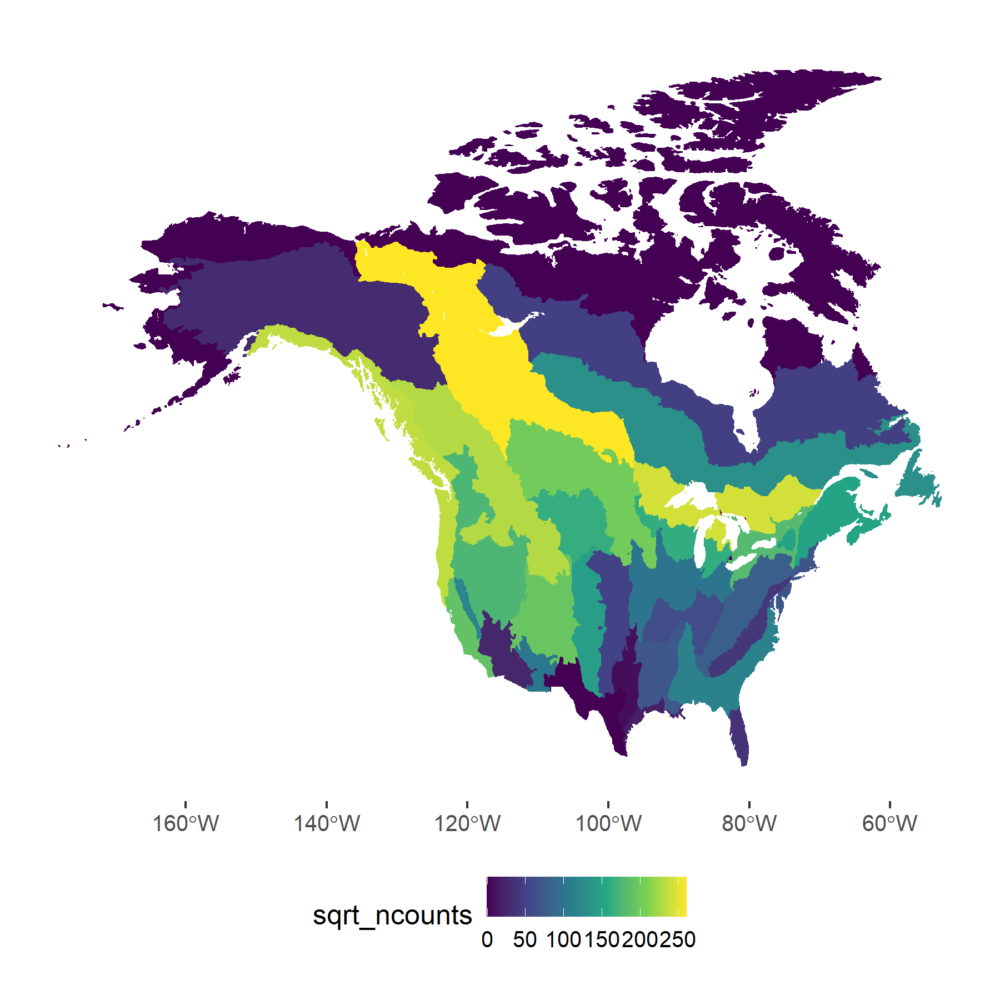

## Data Requirements: any data that meet the following conditions can contribute

#### Field Protocols:

Point counts conducted using field protocols that allow for distance sampling [@marques2011a] and/or removal-model [@farnsworth2002] based estimates of detectability.

The data must be in a format that allows us to estimate the removal and/or distance sampling components, i.e., they must retain the time of observation and/or distance to bird. Our approach can handle both continuous measures of time or distance, or binned-intervals or time or distance, and any combination of time and distance. Even point count data that only include observations of birds separated into two distance bands (e.g., \<50m and \>50m) or two time intervals (e.g., 1-3 minutes and 3-5 minutes) are useful.

#### Ancillary info

Each point count event must also have associated information on:

-   spatial x-y coordinates (and their associated datum)

-   date of observation

-   time of day (start time)

-   duration of count (or end time)

Additional info on surrounding habitat (e.g., forested, open-area, etc.) or observation conditions (e.g., roadside count) are useful, but not necessary.

##### We need both roadside and off-road counts

We have a particular interest in estimating detectability offsets that will allow for the integration of roadside counts (e.g., Breeding Bird Survey counts) with off-road counts (e.g., IMBCR, Atlasses, and eBird). For this goal, we need large numbers of counts in both roadside and off-road conditions.

#### Geographic Coverage

To date, we have observations covering much of North America, but there are some notable gaps in our coverage in the Northeastern United States, Alaska, and Mexico (Yellow areas).

### Data use and security

Our project goals are fundamentally open-data and open-source.

We aim to create a public resource for use in broad-scale population estimation and monitoring, and for countless research, conservation, and management applications. Many of the data contributed to this project will already be publicly available. Private data can also contribute to the project without being made public, through our hierarchical structure of mixed public and private GitHub repositories. We encourage the use of permissive licenses, such as Creative Commons for data and text, open-source (GPL or MIT) to establish a transparent workflow, and also clearly stating intellectual contributions. The [project's GitHub organization](https://github.com/orgs/na-pops) will also house all of the open-source code, results, and documentation for users.
